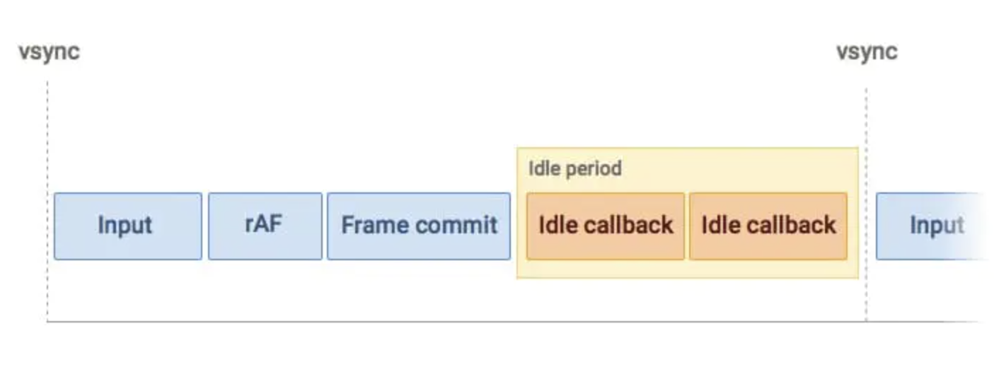

## requestAnimationFrame

以浏览器60HZ计算的花，1帧时间=1000/60=16.6ms，在这个时间范围内执行事件图：


1帧主要做的工作：

- 处理用户交互
- js执行
- 帧开始，窗口尺寸变动、页面滚动等操作
- requestAnimationFrame（rAF）
- 布局
- 绘制

可以看到`requestAnimationFrame`会在每1帧布局前执行

## requestIdleCallback

在1帧16.6ms内如果执行完事件后还有时间剩余，会执行`requestIdleCallback`


所以，`requestIdleCallback`不一定在每帧都执行。如果没有剩余时间则不执行，不过可以通过入参控制强制执行

假如浏览器一直处于非常忙碌的状态，`requestIdleCallback` 注册的任务有可能永远不会执行。此时可通过设置 `timeout`，表示超过这个时间后，如果任务还没执行，则强制执行，不必等待空闲。同时`requestIdleCallback`会包含一个入参对象：

- `didTimeout`，布尔值，表示任务是否超时，结合 `timeRemaining` 使用。
- `timeRemaining()`，表示当前帧剩余的时间，也可理解为留给任务的时间还有多少。

``` js
function work (deadline) {
 // 如果帧内有富余的时间，或者超时
 if ((deadline.timeRemaining() > 0 || deadline.didTimeout) && tasks.length > 0) {
   //do();
 }
}
requestIdleCallback(work, { timeout: 2000 });
```

注意：这种强制执行会拉长1帧的时间造成卡顿！！！

##### cancelIdleCallback

 返回一个唯一 id，可通过 cancelIdleCallback 来取消任务。


## CustomElement

自定义组件

## Event、CustomEvent

自定义事件

## Blob

可以通过Blob的构造函数创建Blob对象：`Blob(blobParts[, options])`,

* `blobParts`： 数组类型， 数组中的每一项连接起来构成Blob对象的数据，数组中的每项元素可以是`ArrayBuffer(二进制数据缓冲区), ArrayBufferView,Blob,DOMString`。或其他类似对象的混合体。
* `options `：可选参数，可以指定生成的类型如：` {type: 'text/plain'}`；`{endings:"transparent"}`，默认值为`transparent`：表示会保持blob中保存的结束符不变，可选为`native`：表示行结束符会被更改为适合宿主操作系统文件系统的换行符，用于指定包含行结束符`\n`的字符串如何被写入。

应用场景：

1、`File`继承`Blob`，可以通过`blob.slice()`实现分片上传。

2、通过`URL.createObjectURL(new Blob([content]))`方式生成`blob协议url`，如`blob:http://xxx`，可以做为图片文件等资源下载链接。


## FileReader

## Beacon

通过`navigator.sendBeacon`发送post请求，最大数据64KB，可以在离开页面后继续发送，如果离开页面后会收不到响应

应用场景：配合`unload`事件发送统计信息


## DOMContentLoaded

`DOMContentLoaded` 事件发生在 `document` 对象上。

我们必须使用 `addEventListener` 来捕获它：

```js
document.addEventListener("DOMContentLoaded", ready);
// 不是 "document.onDOMContentLoaded = ..."
```

例如：

```js
<script>
  function ready() {
    alert('DOM is ready');

    // 图片目前尚未加载完成（除非已经被缓存），所以图片的大小为 0x0
    alert(`Image size: ${img.offsetWidth}x${img.offsetHeight}`);
  }

  document.addEventListener("DOMContentLoaded", ready);
</script>


```

在示例中，`DOMContentLoaded` 处理程序在文档加载完成后触发，所以它可以查看所有元素，包括它下面的 `` 元素。

但是，它不会等待图片加载。因此，`alert` 显示其大小为零。

乍一看，`DOMContentLoaded` 事件非常简单。DOM 树准备就绪 —— 这是它的触发条件。它并没有什么特别之处。

#### DOMContentLoaded 和脚本

当浏览器处理一个 HTML 文档，并在文档中遇到 `script`标签时，就会在继续构建 DOM 之前运行它。这是一种防范措施，因为脚本可能想要修改 DOM，甚至对其执行 `document.write` 操作，所以 `DOMContentLoaded` 必须等待脚本执行结束。

因此，`DOMContentLoaded` 肯定在下面的这些脚本执行结束之后发生：

```js
<script>
  document.addEventListener("DOMContentLoaded", () => {
    alert("DOM ready!");
  });
</script>

<script src="https://cdnjs.cloudflare.com/ajax/libs/lodash.js/4.3.0/lodash.js"></script>

<script>
  alert("Library loaded, inline script executed");
</script>
```

在上面这个例子中，我们首先会看到 “Library loaded…”，然后才会看到 “DOM ready!”（所有脚本都已经执行结束）。

**不会阻塞 `DOMContentLoaded` 的脚本**

此规则有两个例外：

1. 具有 `async` 特性（attribute）的脚本不会阻塞 `DOMContentLoaded`
2. 使用 `document.createElement('script')` 动态生成并添加到网页的脚本也不会阻塞 `DOMContentLoaded`。

#### DOMContentLoaded 和样式

外部样式表不会影响 DOM，因此 `DOMContentLoaded` 不会等待它们。

但这里有一个陷阱。如果在样式后面有一个脚本，那么该脚本必须等待样式表加载完成：

```js
<link type="text/css" rel="stylesheet" href="style.css">
<script>
  // 在样式表加载完成之前，脚本都不会执行
  alert(getComputedStyle(document.body).marginTop);
</script>
```

原因是，脚本可能想要获取元素的坐标和其他与样式相关的属性，如上例所示。因此，它必须等待样式加载完成。

当 `DOMContentLoaded` 等待脚本时，它现在也在等待脚本前面的样式。

#### 浏览器内建的自动填充

Firefox，Chrome 和 Opera 都会在 `DOMContentLoaded` 中自动填充表单。

例如，如果页面有一个带有登录名和密码的表单，并且浏览器记住了这些值，那么在 `DOMContentLoaded` 上，浏览器会尝试自动填充它们（如果得到了用户允许）。

因此，如果 `DOMContentLoaded` 被需要加载很长时间的脚本延迟触发，那么自动填充也会等待。你可能在某些网站上看到过（如果你使用浏览器自动填充）—— 登录名/密码字段不会立即自动填充，而是在页面被完全加载前会延迟填充。这实际上是 `DOMContentLoaded` 事件之前的延迟。

## window.onload

当整个页面，包括样式、图片和其他资源被加载完成时，会触发 `window` 对象上的 `load` 事件。可以通过 `onload` 属性获取此事件。

下面的这个示例正确显示了图片大小，因为 `window.onload` 会等待所有图片加载完毕：

```js
<script>
  window.onload = function() { 
    // 与此相同 window.addEventListener('load', (event) => {
    alert('Page loaded');

    // 此时图片已经加载完成
    alert(`Image size: ${img.offsetWidth}x${img.offsetHeight}`);
  };
</script>


```

## window.onunload

当访问者离开页面时，`window` 对象上的 `unload` 事件就会被触发。我们可以在那里做一些不涉及延迟的操作，例如关闭相关的弹出窗口。

有一个值得注意的特殊情况是发送分析数据。

假设我们收集有关页面使用情况的数据：鼠标点击，滚动，被查看的页面区域等。

自然地，当用户要离开的时候，我们希望通过 `unload` 事件将数据保存到我们的服务器上。

有一个特殊的 `navigator.sendBeacon(url, data)` 方法可以满足这种需求

它在后台发送数据，转换到另外一个页面不会有延迟：浏览器离开页面，但仍然在执行 `sendBeacon`。

使用方式如下：

```js
let analyticsData = { /* 带有收集的数据的对象 */ };

window.addEventListener("unload", function() {
  navigator.sendBeacon("/analytics", JSON.stringify(analyticsData));
};
```

- 请求以 POST 方式发送。
- 我们不仅能发送字符串，还能发送表单以及其他格式的数据，在 文章 "fetch-basics" 未找到 一章有详细讲解，但通常它是一个字符串化的对象。
- 数据大小限制在 64kb。

当 `sendBeacon` 请求完成时，浏览器可能已经离开了文档，所以就无法获取服务器响应（对于分析数据来说通常为空）。


## window.onbeforeunload

如果访问者触发了离开页面的导航（navigation）或试图关闭窗口，`beforeunload` 处理程序将要求进行更多确认。

如果我们要取消事件，浏览器会询问用户是否确定。

你可以通过运行下面这段代码，然后重新加载页面来进行尝试：

```js
window.onbeforeunload = function() {
  return false;
};
```

由于历史原因，返回非空字符串也被视为取消事件。在以前，浏览器曾经将其显示为消息，但是根据 [现代规范](https://html.spec.whatwg.org/#unloading-documents) 所述，它们不应该这样。

这里有个例子：

```js
window.onbeforeunload = function() {
  return "There are unsaved changes. Leave now?";
};
```

它的行为已经改变了，因为有些站长通过显示误导性和恶意信息滥用了此事件处理程序。所以，目前一些旧的浏览器可能仍将其显示为消息，但除此之外 —— 无法自定义显示给用户的消息。

## readyState

如果我们将 `DOMContentLoaded` 事件处理程序设置在文档加载完成之后，会发生什么？

很自然地，它永远不会运行。

在某些情况下，我们不确定文档是否已经准备就绪。我们希望我们的函数在 DOM 加载完成时执行，无论现在还是以后。

`document.readyState` 属性可以为我们提供当前加载状态的信息。

它有 3 个可能值：

- `loading` —— 文档正在被加载。
- `interactive` —— 文档被全部读取。与 `DOMContentLoaded` 几乎同时发生，但是在 `DOMContentLoaded` 之前发生。
- `complete` —— 文档被全部读取，并且所有资源（例如图片等）都已加载完成。与 `window.onload` 几乎同时发生，但是在` window.onload` 之前发生。

所以，我们可以检查 `document.readyState` 并设置一个处理程序，或在代码准备就绪时立即执行它。

像这样：

```js
function work() { /*...*/ }

if (document.readyState == 'loading') {
  // 仍在加载，等待事件
  document.addEventListener('DOMContentLoaded', work);
} else {
  // DOM 已就绪！
  work();
}
```

还有一个 `readystatechange` 事件，会在状态发生改变时触发，因此我们可以打印所有这些状态，就像这样：

```js
// 当前状态
console.log(document.readyState);

// 状态改变时打印它
document.addEventListener('readystatechange', () => {
	console.log(document.readyState)
});
```

`readystatechange` 事件是跟踪文档加载状态的另一种机制，它很早就存在了。现在则很少被使用。

但是为了完整起见，让我们看看完整的事件流。

这是一个带有 `iframe`，`img` 和记录事件的处理程序的文档：

```js
<script>
  log('initial readyState:' + document.readyState);

  document.addEventListener('readystatechange', () => {
  	log('readyState:' + document.readyState)
  });
  document.addEventListener('DOMContentLoaded', () => {
  	log('DOMContentLoaded')
  });

  window.onload = () => log('window onload');
</script>

<iframe src="iframe.html" onload="log('iframe onload')"></iframe>


<script>
  img.onload = () => log('img onload');
</script>
```
典型输出：

```js
[1] initial readyState:loading
[2] readyState:interactive
[2] DOMContentLoaded
[3] iframe onload
[4] img onload
[4] readyState:complete
[4] window onload
```

方括号中的数字表示发生这种情况的大致时间。标有相同数字的事件几乎是同时发生的（± 几毫秒）。

- 在 `DOMContentLoaded` 之前，`document.readyState` 会立即变成 `interactive`。它们俩的意义实际上是相同的。
- 当所有资源（`iframe` 和 `img`）都加载完成后，`document.readyState` 变成 `complete`。这里我们可以发现，它与 `img.onload`（`img` 是最后一个资源）和 `window.onload` 几乎同时发生。转换到 `complete` 状态的意义与 `window.onload` 相同。区别在于 `window.onload` 始终在所有其他 `load` 处理程序之后运行。


## MutationObserver

监听dom节点变化的api

``` js
var ob = new MutationObserver(function(mutationsList, observer){
  for(let mutation of mutationsList) {
    let type = mutation.type;
    switch (type) {
      case "childList":
        console.log("子节点新增或移除");
        break;
      case "attributes":
        console.log(`目标节点${mutation.attributeName} 属性被修改`);
        break;
      case "subtree":
        console.log("子元素被修改");
        break;
      default:
        break;
    }
  }
})

// 开始监听
 ob.observe(document.querySelector('#app'),{ attributes: true, childList: true, subtree: true })
//移除监听
observer.disconnect()
//获取所有变化记录
observer.takeRecords()
```


