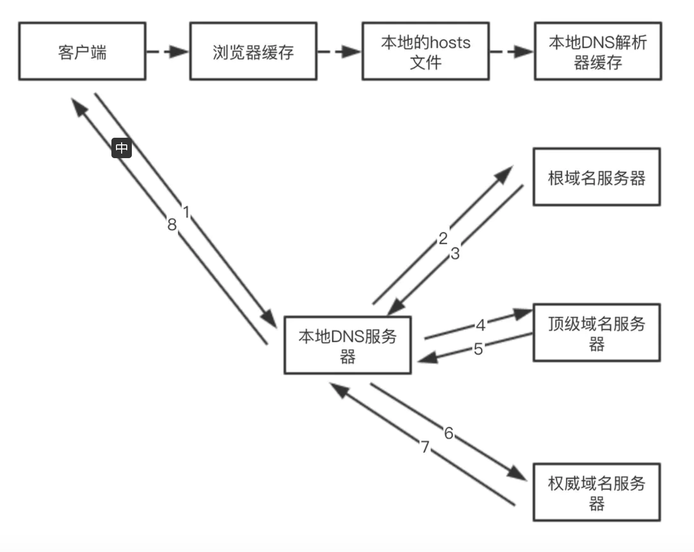

## HTTP1、HTTP2 区别

#### HTTP1 缺陷

- 高延迟 — 队头阻塞

  浏览器限制了同一个域名下的同时请求数量（Chrome 下一般是限制六个连接）,只有上一个请求成功后才会请求下一个，造成客户端无响应，会阻塞请求。

- 无状态特性 — 阻碍交互

  纯净的连接是没有`cookie`的，每一个连接都是一个新的连接，无法记录上一次请求状态

- 明文传输 — 不安全

  传输内容没有加密，传输过程中可能被篡改和劫持

#### HTTP2 优点

- 多路复用

  一个域名对应一个`TCP`连接，一个流代表了一个完整的请求-响应过程。多路复用，就是在一个 TCP 连接中可以存在多个流。

- 头部压缩

  使用专门的 HPACK 算法，每次请求和响应只发送差异`header`，一般可以达到 50%~90% 的高压缩率。

- 请求优先级

  虽然无限的并发流解决了队头阻塞的问题，但如果带宽受限，客户端可能会因防止堵塞通道而阻止请求。在网络通道被非关键资源堵塞时，高优先级的请求会被优先处理。

- 文本传输分割

  所有传输的数据都会被分割，并采用二进制格式编码。

- 服务端推送

  服务端可以在客户端某个请求后，主动推送其他资源，减少其他资源延迟时间。

#### HTTP2 缺陷

- TCP 以及 TCP+TLS 建立连接的延时

  `TCP` 连接需要和服务器进行三次握手，即消耗完 1.5 个 `RTT` 之后才能进行数据传输。

  `TLS`连接有两个版本—— `TLS1.2` 和 `TLS1.3`，每个版本建立连接所花的时间不同，大致需要 1~2 个 `RTT`。

  `RTT（Round-Trip Time）`:往返时延。表示从发送端发送数据开始，到发送端收到来自接收端的确认（接收端收到数据后便立即发送确认），总共经历的时延。

- TCP 的队头阻塞并没有彻底解决

  `TCP` 为了保证可靠传输，有一个“超时重传”机制，丢失的包必须等待重传确认。`HTTP2` 出现丢包时，整个 `TCP` 都要等待重传，那么就会阻塞该 `TCP` 连接中的所有请求。

- 多路复用导致服务器压力上升

  多路复用没有限制同时请求数。请求的平均数量与往常相同，但实际会有许多请求的短暂爆发，导致瞬时 `QPS` 暴增。

- 多路复用容易 Timeout 超时

  大批量的请求同时发送，由于 `HTTP2` 连接内存在多个并行的流，而网络带宽和服务器资源有限，每个流的资源会被稀释，虽然它们开始时间相差更短，但却都可能超时

#### HTTP3(基于 UDP 协议的 QUIC 协议)

- 改进的拥塞控制、可靠传输

- 快速握手

  由于 `QUIC` 是基于 `UDP` 的，所以 `QUIC` 可以实现 `0-RTT` 或者 `1-RTT` 来建立连接，可以大大提升首次打开页面的速度。

- 集成了 TLS 1.3 加密

- 多路复用

  `QUIC` 是为多路复用从头设计的，携带个别流的的数据的包丢失时，通常只影响该流。`QUIC` 连接上的多个 `stream` 之间并没有依赖，也不会有底层协议限制。假如 `stream2`丢了一个包，也只会影响 `stream2` 的处理。

- 连接迁移

## HTTP 状态码

##### 2XX 成功

- 200 OK，表示从客户端发来的请求在服务器端被正确处理
- 201 已创建，请求成功并且服务器创建了新的资源。
- 202 已接受，服务器已接受请求，但尚未处理。
- 203 非授权信息，服务器已成功处理了请求，但返回的信息可能来自另一来源。
- 204 No content，表示请求成功，但响应报文不含实体的主体部分
- 205 Reset Content，表示请求成功，但响应报文不含实体的主体部分，但是与 204 响应不同在于要求请求方重置内容
- 206 Partial Content，进行范围请求, 服务器成功处理了部分 GET 请求。

##### 3XX 重定向

- 301 moved permanently，永久性重定向，表示资源已被分配了新的 URL
- 302 found，临时性重定向，表示资源临时被分配了新的 URL
- 303 see other，表示资源存在着另一个 URL，应使用 GET 方法获取资源
- 304 not modified，表示服务器允许访问资源，但因发生请求未满足条件的情况
- 307 temporary redirect，临时重定向，和 302 含义类似，但是期望客户端保持请求方法不变向新的地址发出请求

##### 4XX 客户端错误

- 400 bad request，请求报文存在语法错误
- 401 unauthorized，表示发送的请求需要有通过 HTTP 认证的认证信息
- 403 forbidden，表示对请求资源的访问被服务器拒绝
- 404 not found，表示在服务器上没有找到请求的资源
- 405 Method not allowed，请求方法错误
- 411 需要有效长度，服务器不接受不含有效内容长度标头字段的请求。
- 412 未满足前提条件，服务器未满足请求者在请求中设置的其中一个前提条件。
- 413 请求实体过大，服务器无法处理请求，因为请求实体过大，超出服务器的处理能力。
- 414 请求的 URI 过长，请求的 URI（通常为网址）过长，服务器无法处理。
- 415 Unsupported media type，不支持的媒体类型，如 Content-Type：application/json 写错为 Content-Type：application/x-www-form-urlencoded
- 471，Expectation  Failed ，http1.1.  POST的时候, HttpClient客户端在Request头部中包含Expect:100-continue
  Server接到后 如果回100(continue)这个状态代码，客户端就继续发request body，否则会返回错误代码。

##### 5XX 服务器错误

- 500 internal sever error，表示服务器端在执行请求时发生了错误
- 501 Not Implemented，表示服务器不支持当前请求所需要的某个功能
- 502 Bad Gateway，作为网关或者代理工作的服务器尝试执行请求时，从上游服务器接收到无效的响应。
- 503 service unavailable，表明服务器暂时处于超负载或正在停机维护，无法处理请求
- 504 Gateway Timeout，服务器响应超时。
- 505 HTTP 版本不受支持，服务器不支持请求中所用的 HTTP 协议版本。

## HTTP 头部

##### Connection:keep-alive

HTTP1.1 默认开启长连接

- 短连接

所谓短连接，就是每次请求一个资源就建立连接，请求完成后连接立马关闭。每次请求都经过“创建 tcp 连接->请求资源->响应资源->释放连接”这样的过程

- 长连接

所谓长连接(persistent connection)，就是只建立一次连接，多次资源请求都复用该连接，完成后关闭。要请求一个页面上的十张图，只需要建立一次 tcp 连接，然后依次请求十张图，等待资源响应，释放连接。

开启 keep-alive 后，如何知道请求结束了呢？HTTP1.1 的版本里， 解决方案是 request 和 reponse 里使用`contentLength`来帮助确认是否收到全部数据。

## HTTPS

> 定义：传输层协议，在 HTTP 的应用层和 TCP/IP 增加了一个 SSL /TLS 层，其实也是属于应用层，主要用来对数据进行加解密，保证数据的传输的正确性

应用了密码学`非对称加密`加密算法。特点是私钥加密后的密文，只要是公钥，都可以解密，但是公钥加密后的密文，只有私钥可以解密。私钥只有一个人有，而公钥可以发给所有的人。

HTTPS 流程：

- 1、客户端获取请求站点的证书与签名（第三方机构颁发）
- 2、与本地第三方机构证书(浏览器本地维护的权威机构证书列表)验证签名是否正确
- 3、验证成功获取证书公钥与服务器协商对称私钥，对传输通过公钥加密
- 4、服务器通过私钥解密密文，成功则进行请求任务，否则拒绝。

## HTTP 请求方式

##### 简单请求

请求方法是以下三种方法之一：

- `HEAD`
- `GET`
- `POST`

HTTP 的请求头信息不超出以下几种字段：

- `Accept`
- `Accept-Language`
- `Content-Language`
- `Last-Event-ID`
- `Content-Type`：只限于三个值`application/x-www-form-urlencoded`、`multipart/form-data`、`text/plain`

##### 复杂请求

复杂请求是那种对服务器有特殊要求的请求，比如请求方法是`PUT`或`DELETE`，或者`Content-Type`字段的类型是`application/json`。复杂请求的`CORS`请求，会在正式通信之前，增加一次`HTTP`查询请求，称为"预检"(`OPTIONS`)请求（preflight）,注意`OPTIONS`请求是不带任何 Cookie 信息的。

- `Access-Control-Request-Method`：该字段是必须的，用来列出浏览器的`CORS`请求会用到哪些 HTTP 方法，上例是 PUT。
- `Access-Control-Request-Headers`：该字段是一个逗号分隔的字符串，指定浏览器`CORS`请求会额外发送的头信息字段，上例是`X-Custom-Header`。

如果浏览器否定了"预检"请求，会返回一个正常的`HTTP`回应，但是没有任何`CORS`相关的头信息字段。这时，浏览器就会认定，服务器不同意预检请求，因此触发一个错误，被 XMLHttpRequest 对象的 onerror 回调函数捕获

## TCP

TCP 是一个面向连接的、可靠的、基于字节流的传输层协议。

UDP 是一个面向无连接的传输层协议

- **面向连接**。所谓的连接，指的是客户端和服务器的连接，在双方互相通信之前，TCP 需要三次握手建立连接，而 UDP 没有相应建立连接的过程。

- **可靠性**。TCP 花了非常多的功夫保证连接的可靠，这个可靠性体现在哪些方面呢？一个是有状态，另一个是可控制。

  - **有状态**。记录哪些数据发送及接受，保证数据包按序到达。
  - **可控制**。当丢包了或者网络环境不佳，TCP 会根据具体情况调整自己的行为，控制自己的发送速度或者重发

- **面向字节流**。UDP 的数据传输是基于数据报的，这是因为仅仅只是继承了 IP 层的特性，而 TCP 为了维护状态，将一个个 IP 包变成了字节流。

##### 三次握手（建立 TCP 连接）

- 第一次握手：建立连接。客户端发送连接请求报文段，将 SYN 位置为 1，Sequence Number 为 x；然后，客户端进入 SYN_SEND 状态，等待服务器的确认；

- 第二次握手：服务器收到 SYN 报文段。服务器收到客户端的 SYN 报文段，需要对这个 SYN 报文段进行确认，设置 Acknowledgment Number 为 x+1(Sequence Number+1)；同时，自己还要发送 SYN 请求信息，将 SYN 位置为 1，Sequence Number 为 y；服务器端将上述所有信息放到一个报文段（即 SYN+ACK 报文段）中，一并发送给客户端，此时服务器进入 SYN_RECV 状态；

- 第三次握手：客户端收到服务器的 SYN+ACK 报文段。然后将 Acknowledgment Number 设置为 y+1，向服务器发送 ACK 报文段，这个报文段发送完毕以后，客户端和服务器端都进入 ESTABLISHED 状态，完成 TCP 三次握手。

##### 四次挥手（关闭 TCP 连接）

- 第一次分手：主机 1（可以使客户端，也可以是服务器端），设置 Sequence Number 和 Acknowledgment Number，向主机 2 发送一个 FIN 报文段；此时，主机 1 进入 FIN_WAIT_1 状态；这表示主机 1 没有数据要发送给主机 2 了；

- 第二次分手：主机 2 收到了主机 1 发送的 FIN 报文段，向主机 1 回一个 ACK 报文段，Acknowledgment Number 为 Sequence Number 加 1；主机 1 进入 FIN_WAIT_2 状态；主机 2 告诉主机 1，我"同意"你的关闭请求；

- 第三次分手：主机 2 向主机 1 发送 FIN 报文段，请求关闭连接，同时主机 2 进入 LAST_ACK 状态；

- 第四次分手：主机 1 收到主机 2 发送的 FIN 报文段，向主机 2 发送 ACK 报文段，然后主机 1 进入 TIME_WAIT 状态；主机 2 收到主机 1 的 ACK 报文段以后，就关闭连接；此时，主机 1 等待 2MSL 后依然没有收到回复，则证明 Server 端已正常关闭，那好，主机 1 也可以关闭连接了。

## DNS

将域名地址字符串解析为对应的 `IP` 地址

`DNS`服务器分类：

- 本地`DNS`缓存：将解析到的域名和`IP`地址缓存到本地，方便下次查找
- 本地`DNS`服务器
  - 如果电脑设置了`DNS`，你就默认这个
  - 如果根据路由器`DHCP`分配，那么就是路由器的`DNS`地址
  - 路由器会将请求分发到上层网络服务商的`DNS`
- 根域名服务器
  - `.com`、`.cn`、`.net`顶级域名服务器对应的 IP
- 顶级域名服务器：在它其中包含了权威域名的服务器的 IP 地址
- 权威域名服务器：返回域名对应的目标主机 IP

如敲下域名`www.baidu.com`查找整个`DNS`过程

- 1、逐级去浏览器缓存、本地 hosts 文件、本地缓存中查找域名对应的 `IP` 是否存在，如果存在则直接返回
- 2、如果不存在则去本地 `DNS` 服务器中查找，如果本地 `DNS`服务器有则直接返回
- 3、如果本地 `DNS` 服务器中不存在则开始递归查找
- 4、首先查找根域名服务器发现访问的是 `.com` 然后返回给本地 `.com` `DNS` 服务器对应的 `IP` 地址
- 5、然后本地继续去请求 `.com` 这个顶级域名服务器，顶级域名服务器查找到了 www.baidu.com 对应的 `DNS` 服务器的 `IP` 地址返回给客户端
- 6、然后本地去请求 www.baidu.com 对应的 `DNS` 服务器解析这个域名，`DNS` 服务器解析后返回对应的主机 `IP` 地址

* `DNS`的域名查找，在客户端、浏览器、本地`DNS`之间的查询方式是递归查询；
* 在本地`DNS`服务器与根域及其子域之间的查询方式是迭代查询；

## CDN

CDN 是构建在现有网络基础之上的智能虚拟网络，依靠部署在各地的边缘服务器，通过中心平台的负载均衡、内容分发、调度等功能模块，使用户**就近获取所需内容**，降低网络拥塞，提高用户访问响应速度和命中率。CDN 的关键技术主要有**内容存储**和**分发技术**

- 内容存储

可以存储图片、文件等，如果有区域用户访问，则在用户最近的节点缓存资源，下次有其他用户访问时直接读取缓存资源。

- 分发技术

中心结点下分有区域节点、边缘节点，离用户最近的边缘节点缓存用户访问的资源，当前边缘节点无请求资源时会向同级边缘节点请求，只有所有边缘节点无数据才会向区域节点请求，然后逐级向上查找。

##### CDN 回源

从边缘结点（离用户最近的数据中心）-> 区域结点-> 中心节点 一层层访问，访问到数据后会依次缓存到对应的数据中心节点中。

##### CDN 带来的问题

防盗链问题

- 请求附带 refer 标示来源
- 时间戳防盗链

数据过期问题

- 当服务器数据更新后，CDN 数据还未更新时静态资源访问可能存在不一致的问题
- 资源都是有设置过期时间的，等到过期时间到了就会回源拉取最新内容
- 主动刷新 CDN 缓存，强制性的让缓存失效全部回源拉取最新数据

## 从输入 URL 到页面展示，发生了什么

- 1、DNS 域名解析
- 2、建立 TCP 连接
- 3、发起 HTTP 请求，服务器处理请求...
- 4、关闭 TCP 连接
- 5、浏览器渲染
  - 构建 DOM 树
  - 样式计算
  - 页面布局
  - 生成分层树
    - 如一些复杂的 3D 变换、页面滚动，或者使用 z-indexing 做 z 轴排序等，为了更加方便地实现这些效果，渲染引擎还需要为特定的节点生成专用的图层，并生成一棵对应的图层树（LayerTree）
  - 栅格化
    - 合成线程会按照视口附近的图块来优先生成位图，实际生成位图的操作是由栅格化来执行的。所谓栅格化，是指将图块转换为位图
  - 显示
