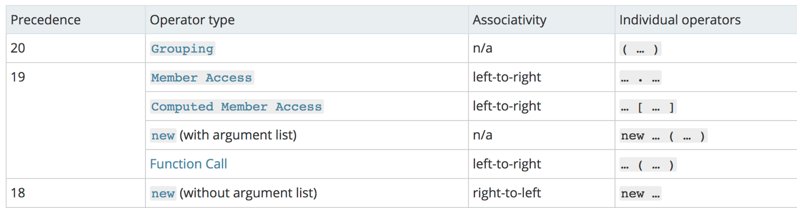

## new 操作符

调用 `new` 的过程:

- 1.、创建一个全新的对象
- 2.、新对象会链接到原型
- 3.、新对象绑定 this指向
- 4.、返回新对象

```js
var Fn = function{}
var a = new Fn()
//创建一个新对象  var a = {}
//指向原型  		 a.__proto__ = Fn.prototype
//绑定this 			Fn.apply(this)
//返回对象a
```


模拟`new`实现：

```js
function create() {
  // 创建一个空的对象
  let obj = new Object();
  // 获得构造函数
  let Con = [].shift.call(arguments);
  // 链接到原型
  obj.__proto__ = Con.prototype;
  // 绑定 this，执行构造函数
  let result = Con.apply(obj, arguments);
  // 确保 new 出来的是个对象
  return typeof result === "object" ? result : obj;
}
```

对于实例对象来说，都是通过 `new` 产生的，无论是 `function Foo()` 还是 `let a = { b : 1 }` 。

对于创建一个对象来说，更推荐使用字面量的方式创建对象（无论性能上还是可读性）。因为你使用 `new Object()` 的方式创建对象需要通过作用域链一层层找到 `Object`，但是你使用字面量的方式就没这个问题。

```js
function Foo() {}
// function 就是个语法糖
// 内部等同于 new Function()
let a = { b: 1 };
// 这个字面量内部也是使用了 new Object()
```

对于 `new` 来说，还需要注意下运算符优先级。

```js
function Foo() {
  return this;
}
Foo.getName = function() {
  console.log("1");
};
Foo.prototype.getName = function() {
  console.log("2");
};

new Foo.getName(); // -> 1
new Foo().getName(); // -> 2
```



从上图可以看出，`new Foo()` 的优先级大于 `new Foo` ，所以对于上述代码来说可以这样划分执行顺序

```js
new (Foo.getName())();
new Foo().getName();
```

对于第一个函数来说，先执行了 `Foo.getName()` ，所以结果为 1；对于后者来说，先执行 `new Foo()` 产生了一个实例，然后通过原型链找到了 `Foo` 上的 `getName` 函数，所以结果为 2。


## typeof

基本类型用`typeof`来检测，`typeof '1212'=== 'string`

## instanceof

`instanceof` 可以正确的判断对象的类型，因为内部机制是通过判断对象的原型链中是不是能找到类型的 `prototype`。

``` js
const box = [1,2,3];
console.log(box instanceof Array); //true
```


模拟实现一下 `instanceof`

```js
function instanceof(left, right) {
  // 获得类型的原型
  let prototype = right.prototype;
  // 获得对象的原型
  left = left.__proto__;
  // 判断对象的类型是否等于类型的原型
  while (true) {
    if (left === null) return false;
    if (prototype === left) return true;
    left = left.__proto__;
  }
}
```
