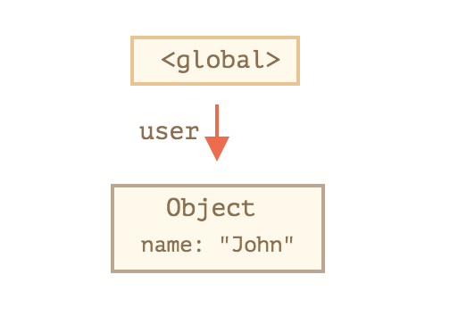
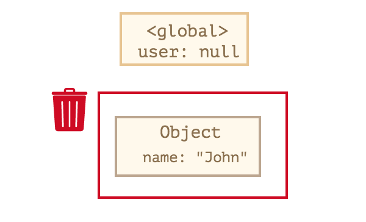
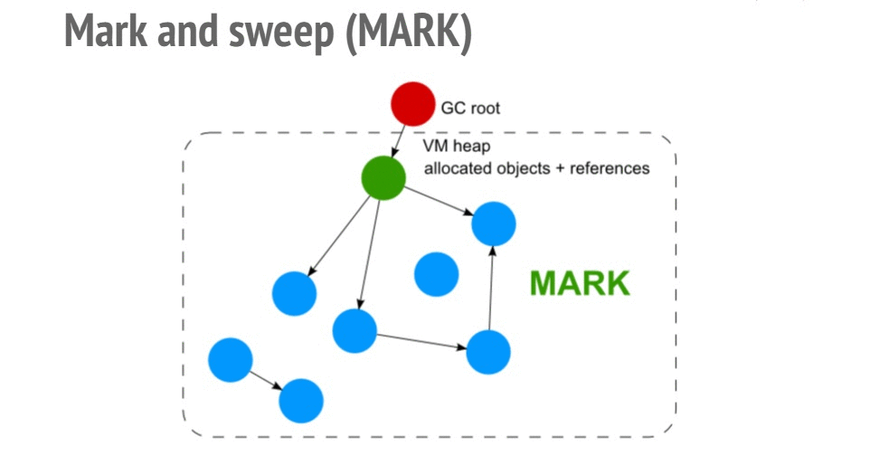

## 可达性

如果从根节点可以访问引用或引用链上值，说明是可达的，这个值是一定存在内存中的。

以下为固有的可达值，统称为**根**，是不会被释放回收的

* **当前函数的局部变量和参数**
* **嵌套调用时，当前调用链上的所有函数和参数**
* **全部变量**
* **一些内部变量**

例子：

``` js
var user = { name:"John" }
user = null
```

全部变量`user`开始引用对象 `{ name:"John" }`，当`user`被置为`null`时，对象引用不可达，则对象`{ name:"John" }`被回收。

<center class="half">


</center>


## 内部算法

#### 标记清除算法
垃圾回收的基本算法被称为 “mark-and-sweep”，就是标记清除算法。

1、定期执行垃圾回收步骤

- root对象包括全局对象以及程序当前的执行堆栈；
- 从root对象出发，遍历其所有子对象，能够通过遍历访问到的对象是可以访问的；
- 重复操作，直到所有可达的（从根部）引用都被访问到；
- 其他不能遍历对象是不可访问的，其内存空间可以回收。



>  注意：V8 实现了准确式 GC，GC 算法采用了分代收集回收机制。因此，V8 将内存（堆）分为**新生代**和**老生代**两部分。

- **分代收集**：对象被分成两组：“新的” 和 “旧的”。许多对象出现，完成他们的工作并很快死去，他们可以很快被清理。那些长期存活的对象会变得“老旧”，而且被检查的频次也会减少。
- **增量收集**：如果有许多对象，并且我们试图一次遍历并标记整个对象集，则可能需要一些时间，并在执行过程中带来明显的延迟。所以引擎试图将垃圾收集工作分成几部分来做。然后将这几部分会逐一进行处理。这需要他们之间有额外的标记来追踪变化，但是这样会有许多微小的延迟而不是一个大的延迟。
- **闲时收集** ：垃圾收集器只会在 CPU 空闲时尝试运行，以减少可能对代码执行的影响。

2、回收时间节点
- 采用多线程的方式进行垃圾回收，尽量避免对JavaScript本身的代码执行造成暂停；
- 利用浏览器渲染页面的空闲时间进行垃圾回收；
- 根据The Generational Hypothesis，大多数对象的生命周期非常短暂，因此可以将对象根据生命周期进行区分，生命周期短的对象与生命周期长的对象采用不同的方式进行垃圾回收；
- 对内存空间进行整理，消除内存碎片化，最大化利用释放的内存空间；

#### 新生代算法

新生代中的对象一般存活时间较短，在新生代空间中，内存空间分为两部分，分别为` From` 空间和` To` 空间。在这两个空间中，必定有一个空间是使用的，另一个空间是空闲的。新分配的对象会被放入 From 空间中，当 From 空间被占满时，新生代 GC 就会启动。算法会检查 `From` 空间中存活的对象并复制到` To` 空间中，如果有失活的对象就会销毁。当复制完成后将` From` 空间和` To` 空间互换，这样 `GC` 就结束了。

#### 老生代算法

老生代中的对象一般存活时间较长且数量也多，使用了两个算法，分别是标记清除算法和标记压缩算法。

下列情况对象会出现在老生代空间中：

- 新生代中的对象是否已经经历过一次 Scavenge 算法，如果经历过的话，会将对象从新生代空间移到老生代空间中。
- To 空间的对象占比大小超过 25 %。在这种情况下，为了不影响到内存分配，会将对象从新生代空间移到老生代空间中。

在老生代中，以下情况会先启动标记清除算法：

- 某一个空间没有分块的时候
- 空间中被对象超过一定限制
- 空间不能保证新生代中的对象移动到老生代中

在这个阶段中，会遍历堆中所有的对象，然后标记活的对象，在标记完成后，销毁所有没有被标记的对象。在标记大型对内存时，可能需要几百毫秒才能完成一次标记。这就会导致一些性能上的问题，这个时候会启动**增量收集**，同时如果CPU空闲时会启动**闲时收集**。

清除对象后会造成堆内存出现碎片的情况，当碎片超过一定限制后会启动压缩算法。在压缩过程中，将活的对象像一端移动，直到所有对象都移动完成然后清理掉不需要的内存。

## 总结

- 垃圾回收是自动完成的，我们不能强制执行或是阻止执行。
- 当对象是可达状态时，它一定是存在于内存中的。
- 被引用与可访问（从一个根）不同：一组相互连接的对象可能整体都不可达。


##  内存泄露

如果内存中存在大量的未释放对象及变量，达到内存最大值时会造成内存泄露。

通常以快照的方式记录内存泄露前后的调用栈记录，生成快照以node 为例

```js
npm i heapdump
```

然后在可能出现内存泄露的地方打印快照

```js
heapdump.writeSnapshot(`./dist/${Date.now()}.heapsnapshot`);
```

将快照导入到 `chrome devtools memory` 分析火焰图
