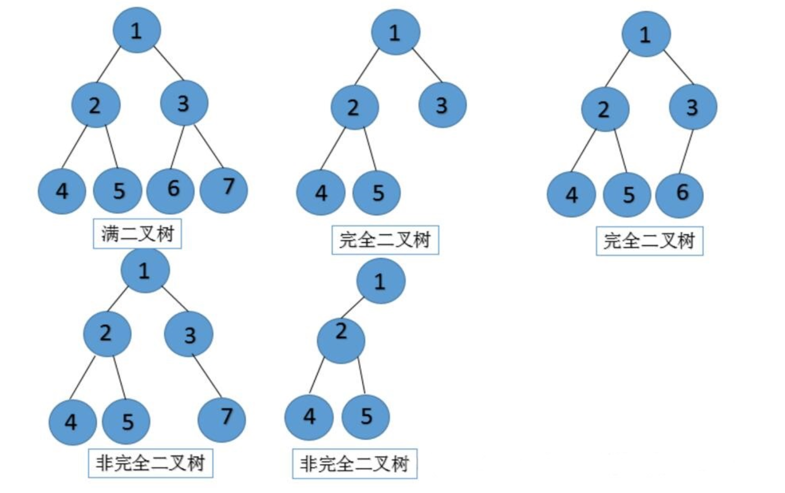
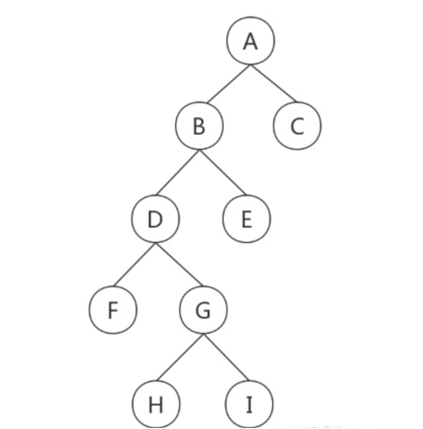

## 栈

栈是一种`线性结构`，动态分配的空间：一般手动分配释放， 若不释放，程序结束时可能由操作系统自动垃圾回收，分配方式类似于链表

栈的特点是只能在某一端添加或删除数据，遵循`后进先出（LIFO）`的原则

在 javascript 中 原生类型、引用到的对象的地址、函数的执行状态、this 值等保存在栈内存中，当一个函数执行结束，那么该函数的执行上下文便会被销毁掉，基本数据类型占用空间小、大小固定，通过按值来访问，属于被频繁使用的数据。

栈的优势和缺点：

- 栈的结构非常适合函数调用过程。
- **在栈上分配资源和销毁资源的速度非常快**，这主要归结于栈空间是连续的，分配空间和销毁空间只需要移动下指针就可以了。
- 虽然操作速度非常快，但是栈也是有缺点的，其中最大的缺点也是它的优点所造成的，那就是**栈是连续的**，所以要想在内存中分配一块连续的大空间是非常难的，因此**栈空间是有限的**。

## 堆

堆是一种经过排序的`树形结构`，每个结点都有一个值。通常我们所说的堆的数据结构，是指二叉堆。堆的特点是根结点的值最小（或最大），且根结点的两个子树也是一个堆。

由于堆的这个特性，**用来存储对象类型的离散的数据**，常用来实现优先队列，堆的存取是随意，这就如同我们在图书馆的书架上取书，

堆一般由操作系统自动分配释放 ，JavaScript 中除了原生类型的数据，其他的都是对象类型，诸如引用类型变量值、函数、函数的参数值、闭包的变量、数组，在浏览器中还有 window 对象、document 对象等，这些都是存在堆空间的。

## 队列

队列是一种`线性结构`，特点是在某一端添加数据，在另一端删除数据，遵循`先进先出（FIFO）`的原则。

## 链表

链表是一种`线性结构`，同时也是一个天然的`递归结构`。链表结构可以充分利用计算机内存空间，实现灵活的内存动态管理。但是链表失去了数组随机读取的优点，同时链表由于增加了结点的指针域，空间开销比较大。

- `单链式表`：由数据项+尾指针组成，尾指针指向下一个数据项
- `双链式表`：由头指针+数据项+尾指针组成，头指针指向上一个数据项，尾指针指向下一个数据项

## 二叉树

二叉树拥有一个根结点，每个结点至多拥有两个子结点，分别为：左结点、右结点

名词

*  `结点的度`：结点拥有的子树的数目
* `根结点`：没有父结点的结点
* `叶子结点`：度数为0的结点，即没有子结点的结点
* `分支结点`：度数不为0的结点

树类型

* `平衡二叉树`：左右结点深度一样的树

* `满二叉树`：一颗深度为h且有2^h-1个结点的二叉树，即一颗树左右子结点都是二个，满二叉树一定是完全二叉树，（如图第一个）

* `完全二叉树`：除最后一层外，每一层上的节点数均达到最大值，在最后一层上只缺少右边的若干结点

  

遍历方式

* `前序遍历`：首先访问根结点，然后遍历左子树，最后遍历右子树（根->左->右），访问根节点->前序遍历左子树->前序遍历右子树

* `中序遍历`：首先遍历左子树，然后访问根结点，最后遍历右子树（左->根->右），中序遍历左子树->访问根节点->中序遍历右子树

* `后序遍历`：首先遍历左子树，然后遍历右子树，最后访问根结点（左->右->根），后序遍历左子树->后序遍历右子树->访问根节点

  

  

  前序遍历A-B-D-F-G-H-I-E-C         中序遍历F-D-H-G-I-B-E-A-C          后序遍历F-H-I-G-D-E-B-C-A

  注意：已知前中序、中后序可以还原整棵树，只有前后序无法还原树。

性质

* 1：在二叉树的第k层上至多有`2^k-1`个结点（k>=1）
* 2：在深度为m的二叉树至多有`2^m-1`个结点
* 3：对任意一颗二叉树，度为0的结点（即叶子结点）总是比度为2的结点多一个
* 4：具有n个结点的完全二叉树的深度至少为`[log2^n]+1`，其中[log2^n]表示log2%n的整数部分

延伸二叉树

* `二分搜索树`：二分搜索树每个结点的值都比他的左子树的值大，比右子树的值小
* `AVL树`：二分搜索树实际在业务中是受到限制的，因为并不是严格的 O(logN)，在极端情况下会退化成链表，比如加入一组升序的数字就会造成这种情况。AVL 树改进了二分搜索树，在 AVL 树中任意结点的左右子树的高度差都不大于 1，这样保证了时间复杂度是严格的 O(logN)。基于此，对 AVL 树增加或删除结点时可能需要旋转树来达到高度的平衡。

## 字典

前缀树或字典树，是一种有序`树形结构`，用于保存关联数组，其中的键通常是字符串。

简单点来说，这个结构的作用大多是为了方便搜索字符串，该树有以下几个特点

- 根结点代表空字符串，每个结点都有 N（假如搜索英文字符，就有 26 条） 条链接，每条链接代表一个字符
- 结点不存储字符，只有路径才存储，这点和其他的树结构不同
- 从根结点开始到任意一个结点，将沿途经过的字符连接起来就是该结点对应的字符串

## 并查集

并查集是一种特殊的`树形结构`，用于处理一些不交集的合并及查询问题。该结构中每个结点都有一个父结点，如果只有当前一个结点，那么该结点的父结点指向自己。

这个结构中有两个重要的操作，分别是：

- Find：确定元素属于哪一个子集。它可以被用来确定两个元素是否属于同一子集。
- Union：将两个子集合并成同一个集合。
