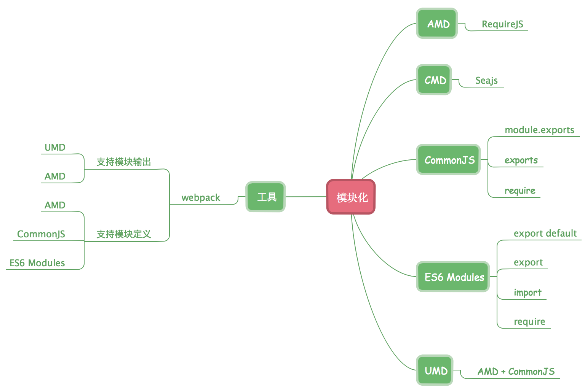

模块化开发，一个模块就是一个功能文件，模块化可以避免变量污染，命名冲突、提高代码复用率及维护性。

## AMD、CMD 差异性

| 规范 |   方式   |      代表 |
| ---- | :------: | --------: |
| AMD  | 按需加载 | requireJS |
| CMD  | 就近依赖 |     seaJS |

案例：

```js
//hello.js
define(() => {
  return {
    name: "hello"
  };
});
//word.js
define(() => {
  return {
    name: "word"
  };
});
```

## AMD

依赖前置原则

```js
define(["./hello", "./word"], (hello, word) => {
  console.log(hello.name + word.name);
});
```

## CMD

就近依赖原则

```js
define(require => {
  const hello = require("./hello");
  const word = require("./word");
  console.log(hello.name + word.name);
});
```

AMD 与 CMD 都是在引用文件初始化时加载完成所有模块，区别是 CMD 是当模块被 require 时才会触发执行

## CommonJS

每个文件就是一个模块，模块是一个对象,对象包括了当前模块的所有信息，有自己的作用域，文件中的变量、函数、类等都是对其他文件不可见的，通过`require()`引入。

#### 加载机制

模块按照其在代码中出现的顺序加载，模块输出的是**值拷贝**

```js
//a.js
let count = 1;
exports.count = count;
exports.add = () => {
  count++;
};

//b.js

const { count, add } = require("./a");
add();
console.log(count); //1
```

说明一旦输出一个值，模块内部的变化就影响不到这个值

## ES6 Modules

ES6 正式提出了内置的模块化语法，在现代浏览器端无需额外引入第三方库进行模块化。

#### 特点

- 模块只加载一次，再次加载从内存中读取
- 模块的变量为局部变量，不会被自动添加到共享的全局作用域
- 模块在严格模式下执行，顶级作用域的 this 值为 undefined
- 需要外部引用的变量或方法必须导出

#### 加载机制

模块为静态解析，只能在文件顶部引入，模块输出的是**对象引用**

```js
//a.js
export let a = 1;
export const add = () => {
  a++;
};

//b.js
import { a, add } from "./a";
console.log(a); //1
add();
console.log(b); //2
```

## UMD

AMD 与 CommonJS 结合体，为了兼容浏览器与服务端


