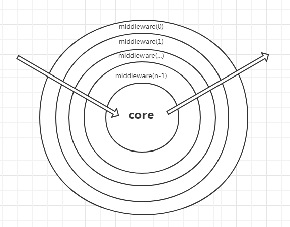

## 原理

koa中间件有个叫法，叫“洋葱模型”，就是请求会从中间件一层一层进入，然后再逐一的返回。



案例解析：依次注册两个中间件

``` js
app.use((ctx,next) => {
  console.log('第一个中间件开始')
  next()
  console.log('第一个中间件结束')
})

app.use((ctx,next) => {
  console.log('第二个中间件开始')
  next()
  console.log('第二个中间件结束')
})

//依次输出
//第一个中间件开始
//第二个中间件开始
//第二个中间件结束
//第一个中间件结束
```


可以看到，中间件会合并执行，在遇到next函数执行时会跳出当前中间件然后执行下个中间件，以此类推，当执行到最后一个中间件后，从最后一个中再往返递减的执行各中间件`next`之后的代码，这就是著名的“洋葱模型”

**所以在写中间件代码时，一定要写`next()`函数，这样可以继续执行以后的中间件，否则就会终止中间件的执行。**


## 源码解析

[koa-compose源码](https://github.com/koajs/compose/blob/master/index.js)

koa-compose是中间件处理逻辑，虽然只有四十几行代码，但是其中的思想确很经典。

```js
function compose (middleware) {
  if (!Array.isArray(middleware)) throw new TypeError('Middleware stack must be an array!')
  for (const fn of middleware) {
    if (typeof fn !== 'function') throw new TypeError('Middleware must be composed of functions!')
  }

  /**
   * @param {Object} context
   * @return {Promise}
   * @api public
   */

  return function (context, next) {
    // last called middleware #
    let index = -1
    return dispatch(0)
    function dispatch (i) {
      // i 是洋葱模型的记录已经运行的函数中间件的下标, 如果一个中间件里面运行两次 next, 那么 i 是会比 index 小的.
      if (i <= index) return Promise.reject(new Error('next() called multiple times'))
      index = i
      let fn = middleware[i]
      //如果执行到最后一个中间件，也就是最里层的中间件圆心，执行这个 next 函数，这个next是在合并中间件时传入的
      if (i === middleware.length) fn = next
      if (!fn) return Promise.resolve()
      try {
        //返回一个promise 方便async调用，继续执行下一个中间件
        return Promise.resolve(fn(context, dispatch.bind(null, i + 1)));
      } catch (err) {
        return Promise.reject(err)
      }
    }
  }
}
```

去除判断条件，就10几行代码，我们结合按理来解析一下源码

``` js
app.use((ctx,next) => {
  console.log('第一个中间件开始')
  next()
  console.log('第一个中间件结束')
})

//转换后
Promise.resolve(((ctx,next)=>{
   console.log('第一个中间件开始')
  next()
  console.log('第一个中间件结束')
})(context,dispatch.bind(null, i + 1)))
```


一个立即执行函数，首先第一步执行 `console.log('第一个中间件开始')`，然后遇到`next()`后会跳到第二个中间件


```js
app.use((ctx,next) => {
  console.log('第二个中间件开始')
  next()
  console.log('第二个中间件结束')
})

//转换后
Promise.resolve(((ctx,next)=>{
  console.log('第一个中间件开始')
  
  Promise.resolve(((ctx,next)=>{
   console.log('第二个中间件开始')
    next()
  	console.log('第二个中间件结束')
	})(context,dispatch.bind(null, 2)))
  
  console.log('第一个中间件结束')
})(context,dispatch.bind(null, 1)))
```

继续执行立即执行函数，执行`console.log('第二个中间件开始')`，然后遇到`next()`此时就两个中间件，源码里`if (i === middleware.length) fn = next`这里的next是合并中间件时传入的，可以在最里层中间件执行完毕后执行，这里是`undefined`，执行`if (!fn) return Promise.resolve()`，所有中间件执行结束。

`resolve`执行后依次从最里面的中间件向外执行`next`后剩余的代码，执行 `console.log('第二个中间件结束')`,`console.log('第一个个中间件结束')`

