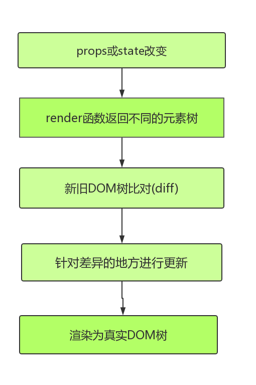
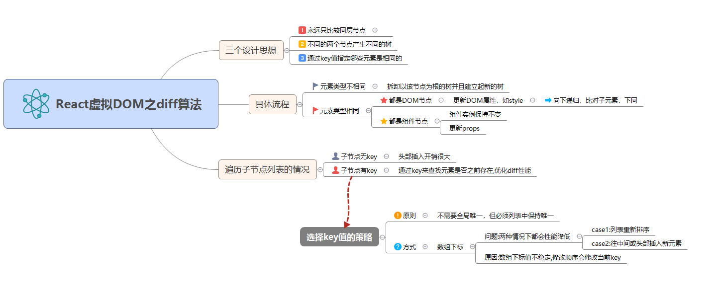
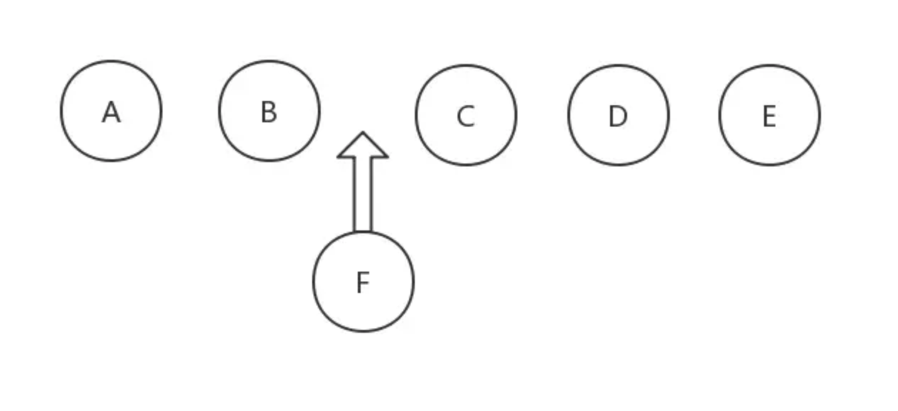

## 渲染机制

##### reconciliation(调解) 过程 （React 15版本）



如上图所示，React 采用的是虚拟 `DOM` (即 `VDOM` )，每次属性 (`props`) 和状态 (`state`) 发生变化的时候，`render` 函数返回不同的元素树，`React` 会检测当前返回的元素树和上次渲染的元素树之前的差异，然后针对差异的地方进行更新操作，最后渲染为真实 DOM，这就是整个 `Reconciliation` 过程，其核心就是进行新旧 `DOM` 树对比的 `diff` 算法。

为了获得更优秀的性能，首当其冲的工作便是 `减少 diff 的过程`，那么在保证应该更新的节点能够得到更新的前提下，这个 diff 的过程如何来避免呢？

答案是利用 `shouldComponentUpdate` 这个声明周期函数。这个函数做了什么事情呢？

默认的 `shouldComponentUpdate` 会在 `props` 和 `state` 发生变化时返回 `true`, 表示组件会重新渲染，从而调用 render 函数，进行新旧 DOM 树的 diff 比对。但是我们可以在这个生命周期函数里面做一些判断，然后返回一个布尔值，并且返回 true 表示即将更新当前组件，false 则不更新当前组件。换句话说，我们可以通过 `shouldComponentUpdate` 控制是否发生 VDOM 树的 diff 过程。

`shouldComponentUpdate` 函数返回 `true` ，需要调用 `render` 方法，进行新旧 VDOM 树的 diff 过程，返回 `false` ，不需要进行 DOM 树的更新。

如果两棵树上的节点类型相同，则递归进入下一层节点的比较；如果节点类型不相同， `React` 的做法非常简单粗暴，直接将 原 `VDOM` 树上该节点以及该节点下所有的后代节点 全部删除，然后替换为新 VDOM 树上同一位置的节点，当然这个节点的后代节点也全都跟着过来了

因此如果能够合理利用 `shouldComponentUpdate`，从而能避免不必要的 `Reconciliation` 过程，使得应用性能可以更加优秀。

`PureComponent`就是应用 `shouldComponentUpdate` 会比较 props 和 state 中的属性是否发生改变 (浅比较) 来判定是否返回 true，从而触发 Reconciliation 过程。

如果用了函数组件，`React` 为提供了一个 `memo` 方法，它和 `PureComponent` 在数据比对上唯一的区别就在于 只进行了 `props` 的浅比较，因为函数组件是没有 `state` 的。而且它的用法很简单，直接将函数传入 `memo`中导出即可。形如:

```js
function Home() {
  //xxx
}
export default memo(Home);
```

## diff 过程



##### 设计思想概述

首先是设计思想，其实从一个树参照另一棵树进行更新，如果利用循环递归的方式对每一个节点进行比较，那算法的复杂度可以到达是 O (n^3), 通俗点来说 1000 个节点的树，要比对 10 亿次，还不包括比对类型、属性等等节点的细节，即使目前性能最高的 CPU 也很难再一秒内算出结果。

但是 `React` 说它的 `diff` 就是能达到 O (n) 级别。

**深度优先遍历**，简单的归纳一下就是下面三条:

- 1、永远只比较同层节点，不会跨层级比较节点。
- 2、不同的两个节点产生不同的树。这也就是上面总结的类型不相同的情况，把原来的节点以及它的后代全部干掉，替换成新的。
- 3、通过 `key` 值指定哪些元素是相同的。(后面来展开介绍。)

##### 执行规则 (流程)

1、元素类型不相同时

见上文分析。

2. 元素类型相同时

**a. 都是 DOM 节点**

```html
<div className="old" title="老节点" />

<div className="new" title="新节点" />
```

通过比对这两个元素，`React` 知道需要修改 `DOM` 元素上的 `className` 属性和 `title` 属性。

处理完该节点后，`React` 继续对子节点进行递归。

**b. 都是组件元素**
组件实例保持不变，更新 `props`。值得注意的是，这时候调用组件实例的 `componentWillReceiveProps ()` 方法。然后通过 `shouldComponentUpdate` 返回值决定是否调用 `render` 方法。

处理完该节点后，依然继续对子节点进行递归。

**特殊情况讨论：遍历子元素列表 引入 key 值**
首先，我们往列表末尾插入一个元素:

```html
<ul>
  <li>1</li>
  <li>2</li>
</ul>
```

插入后为:

```html
<ul>
  <li>1</li>
  <li>2</li>
  <li>3</li>
</ul>
```

`React` 会先匹配两个对应的树，最后插入第三个元素，没有任何问题。

但是如果在头部插入呢？

```html
<ul>
  <li>3</li>
  <li>1</li>
  <li>2</li>
</ul>
```

此时前两个元素和原来都不一样，第三个元素被当作新增的节点，明明只需要更新 1 个节点，现在更新了 3 个。这样的情况效率是非常低的。

于是，React 引入了 key 值的概念。

```html
<ul>
  <li key="first">1</li>
  <li key="second">2</li>
</ul>
```

插入之后变为:

```html
<ul>
  <li key="third">3</li>
  <li key="first">1</li>
  <li key="second">2</li>
</ul>
```

现在 React 通过 key 得知 1 和 2 原来是存在的，现在只是换了位置，因此不需要更新整个节点了，只需要移动位置即可，大大提升效率。

**选取 key 值的问题**
`key` 选取的原一般是 不需要全局唯一，但必须列表中保持唯一。

有很多人喜欢用数组元素的下标作为 `key` 值，在元素顺序不改变的情况是没有问题的，但一旦顺序发生改变，`diff` 效率就有可能骤然下降。

举个例子，现在在五个元素中插入 F



现在由于 F 的插入，后面的 C、D、E 索引值都改变，即`key` 值改变，因此后面的节点都得更新。而且，数组乱序或者在头部插入都会导致同样的更新问题。

> 因此，不用数组索引做 key 值的根本原因在于：数组下标值不稳定，修改顺序会修改当前 key

当我们利用 `key` 值以后，上面的问题便迎刃而解，后面的 C、D、E 只需要向后挪动一个位置即可，真正需要更新的就只有新增的节点了。

#### 模拟 diff 实现

[diff 模拟源码实现](./react/diff-code.md)
