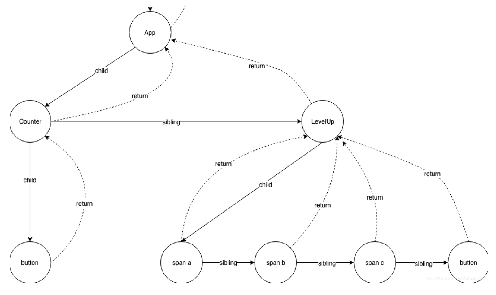

# fiber架构、时间切片


[来源：彻底搞懂React源码调度原理](https://mp.weixin.qq.com/s/pFfpv0-KGmGqtKkm6UZKeg)

时间切片指的是一种将多个粒度小的任务放入一个个时间切片中执行的一种方法。

## 作用

在刚执行完一个时间切片准备执行下一个时间切片前，react能够：

* 判断是否有用户界面交互事件和其他需要执行的代码，比如点击事件，如果有的话则执行概事件。
* 判断是否有优先级更高的任务需要执行，如有则中断当前任务，执行更高的优先级任务，也就是利用时间切片实现高优先级任务插队。

## 实现

##### 1、使用``MessageChannel``通信

使用`MessageChannel`浏览器提供的一种数据通信接口，可用来实现发布订阅，其两个端口支持使用`postMessage`双向通信。

``` js
const channel = new MessageChannel()
const port1 = channel.port1
const port2 = channel.port2

port1.onmessage = e => { console.log( e.data ) }
port2.postMessage('from port2')
```

##### 2、`Fiber`

`React`内部实现的一套状态更新机制。支持任务不同`优先级`，可中断与恢复，并且恢复后可以复用之前的`中间状态`。

> Fiber 架构实际上是个链表结构，每个节点包含了 return（父节点），subling（兄弟节点），children（子节点）。有了链表结构，那就可以进行DFS，而且也可以很轻松的中断 & 恢复；



`Fiber`包含三层含义：

-  作为架构来说，之前`React15`的`Reconciler`采用递归的方式执行，数据保存在递归调用栈中，所以被称为`stack Reconciler`。`React16`的`Reconciler`基于`Fiber节点`实现，被称为`Fiber Reconciler`。
-  作为静态的数据结构来说，每个`Fiber节点`对应一个`React element`，保存了该组件的类型（函数组件/类组件/原生组件...）、对应的DOM节点等信息，React用链表的形式将所有Fiber节点连接，形成链表树（虚拟dom树）。
- 作为动态的工作单元来说，每个`Fiber节点`保存了本次更新中该组件改变的状态、要执行的工作（需要被删除/被插入页面中/被更新...）。

在执行调度工作循环和计算工作循环时，执行每一个工作中Fiber。但是，有一个条件是每隔`5毫秒`，会跳出工作循环，运行一次**异步的`MessageChannel`的`port.postMessage(...)`方法，检查是否存在事件响应、更高优先级任务或其他代码需要执行**，如果有则执行，如果没有则重新创建工作循环，执行剩下的工作中Fiber

