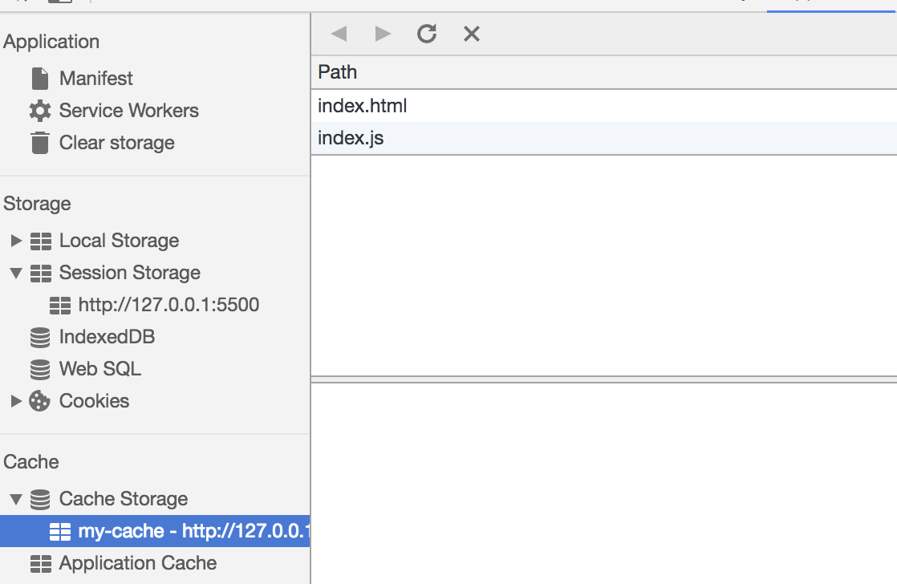

`service worker`是`web worker`的升级版本，相较于后者，前者拥有了持久离线缓存的能力。

一般可用作为浏览器和网络间的代理。它们能够创建有效的离线体验，拦截网络请求并基于网络是否可用以及更新的资源是否驻留在服务器上来采取适当的动作。他们还允许访问推送通知和后台同步 API

## 特点

- 独立于主线程、在后台运行的脚本
- 被`install`后就永远存在，除非被手动卸载
- 可编程拦截请求和返回，缓存文件。sw 可以通过 fetch 这个 api，来拦截网络和处理网络请求，再配合`cacheStorage`来实现 web 页面的缓存管理以及与前端 postMessage 通信。
- 不能直接操纵 dom：因为 sw 是个独立于网页运行的脚本，所以在它的运行环境里，不能访问窗口的 window 以及 dom。
- 线上环境必须是 https 的协议才能使用。
- 异步实现，sw 大量使用 promise。

## 生命周期

- `installing`：这个状态发生在 service worker 注册之后，表示开始安装。在这个过程会触发 install 事件回调指定一些静态资源进行离线缓存。
- `installed`：sw 已经完成了安装，进入了 waiting 状态，等待其他的 Service worker 被关闭（在 install 的事件回调中，可以调用 skipWaiting 方法来跳过 waiting 这个阶段）
- `activating`： 在这个状态下没有被其他的 Service Worker 控制的客户端，允许当前的 worker 完成安装，并且清除了其他的 worker 以及关联缓存的旧缓存资源，等待新的 Service Worker 线程被激活。
- `activated`： 在这个状态会处理 activate 事件回调，并提供处理功能性事件：fetch、sync、push。（在 acitive 的事件回调中，可以调用 self.clients.claim()）
- `redundant`：废弃状态，这个状态表示一个 sw 的使命周期结束

首次导航到网站时，会下载、解析并执行 Service Worker 文件，触发`install`事件，尝试安装 Service Worker，如果`install`事件回调函数中的操作都执行成功，标志 Service Worker 安装成功，此时进入`waiting`状态，注意这时的 Service Worker 只是准备好了而已，并没有生效，当用户二次进入网站时，才会激活 Service Worker，此时会触发`activate`事件，标志 Service Worker 正式启动，开始响应 fetch、post、sync 等事件

## 事件

- `install`：Service Worker 安装时触发，通常在这个时机缓存文件。
- `activate`：Service Worker 激活时触发，通常在这个时机做一些重置的操作，例如处理旧版本 Service Worker 的缓存。
- `fetch`：浏览器发起 HTTP 请求时触发，通常在这个事件的回调函数中匹配缓存，是最常用的事件。
- `push`：和推送通知功能相关，没有相关需求的话可以不去了解。
- `sync`：和后台同步功能相关，没有相关需求的话可以不去了解。

## 用法

```js
// index.js
if (navigator.serviceWorker) {
  navigator.serviceWorker
    .register("sw.js")
    .then(function(registration) {
      console.log("service worker 注册成功");
    })
    .catch(function(err) {
      console.log("servcie worker 注册失败");
    });
}
// sw.js
// 监听 `install` 事件，回调中缓存所需文件
self.addEventListener("install", e => {
  e.waitUntil(
    caches.open("my-cache").then(function(cache) {
      return cache.addAll(["./index.html", "./index.js"]);
    })
  );
});

// 拦截所有请求事件
// 如果缓存中已经有请求的数据就直接用缓存，否则去请求数据
self.addEventListener("fetch", e => {
  e.respondWith(
    caches.match(e.request).then(function(response) {
      if (response) {
        return response;
      }
      console.log("fetch source");
    })
  );
});
```

打开页面，可以在开发者工具中的 `Application` 看到 Service Worker 已经启动了


在 Cache 中也可以发现我们所需的文件已被缓存



当我们重新刷新页面可以发现我们缓存的数据是从 Service Worker 中读取的


## 插件 workbox-webpack-plugin

workbox 是 google 官方的 pwa 框架，workbox-webpack-plugin 是由其产生的其中一个工具，可以配合 webpack 使用缓存静态资源

目前该技术通常用来做缓存文件，提高首屏速度，可以试着来实现这个功能。

## 应用场景

service worker 一般和 pwa 做离线站点使用，如果轻易使用会造成客户端场景更复杂，不受控制。

如果真有必要应用到生成环境，要做到后备条件，比如通过服务端接口实现接口开关，可以自由控制开关 service worker 功能
