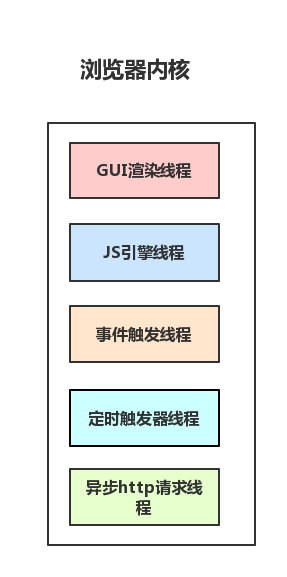

## 区分进程与线程

- 进程是 `cpu` 资源分配的最小单位（是能拥有资源和独立运行的最小单位）
- 线程是 `cpu` 调度的最小单位（线程是建立在进程的基础上的一次程序运行单位，一个进程中可以有多个线程）

> - 不同进程之间也可以通信，不过代价较大
> - 现在，一般通用的叫法：单线程与多线程，都是指在一个进程内的单和多。（所以核心还是得属于一个进程才行）

举例：

- 进程是一个工厂，工厂有它的独立资源，且工厂之间相互独立
- 线程是工厂中的工人，多个工人协作完成任务,工厂内有一个或多个工人,工人之间共享资源

## 浏览器包含哪些进程

**1、`Browser` 进程：浏览器的主进程（负责协调、主控），只有一个。**

- 负责浏览器界面显示，与用户交互。如前进，后退等
- 负责各个页面的管理，创建和销毁其他进程
- 将 `Renderer` 进程得到的内存中的 `Bitmap`，绘制到用户界面上
- 网络资源的管理，下载等

**2、第三方插件进程：每种类型的插件对应一个进程，仅当使用该插件时才创建**

**3、`GPU` 进程：最多一个，用于 `3D` 绘制等**

**4、浏览器渲染进程（浏览器内核）（`Renderer` 进程，内部是多线程的）：默认每个 Tab 页面一个进程，互不影响。**

- 页面渲染，脚本执行，事件处理等

> 在浏览器中打开一个网页相当于新起了一个进程（进程内有自己的多线程）

## 浏览器渲染进程

#### 有哪些渲染线程

- 1.`GUI` 渲染线程

  - 负责渲染浏览器界面，解析 `HTML`，`CSS`，构建 `DOM` 树和 `RenderObject` 树，布局和绘制等。
  - 当界面需要重绘（`Repaint`）或由于某种操作引发回流(`reflow`)时，该线程就会执行
  - 注意，`GUI` 渲染线程与 `JS` 引擎线程是互斥的，当 `JS` 引擎执行时 `GUI` 线程会被挂起（相当于被冻结了），`GUI` 更新会被保存在一个队列中等到 `JS` 引擎空闲时立即被执行。

- 2.`JS` 引擎执行线程

  - 也称为 `JS` 内核，负责处理 `Javascript` 脚本程序。（例如 `V8` 引擎）
  - `JS` 引擎线程负责解析 `Javascript` 脚本，运行代码。
  - `JS` 引擎一直等待着任务队列中任务的到来，然后加以处理，一个 `Tab` 页（`renderer` 进程）中无论什么时候都只有一个 `JS` 线程在运行`JS`程序
  - 同样注意，`GUI` 渲染线程与 `JS` 引擎线程是互斥的，所以如果 `JS` 执行的时间过长，这样就会造成页面的渲染不连贯，导致页面渲染加载阻塞。

- 3.事件触发线程

  - 归属于浏览器而不是`JS`引擎，用来控制事件循环（可以理解，`JS` 引擎自己都忙不过来，需要浏览器另开线程协助）
  - 当`JS`引擎执行代码块如 `setTimeOut` 时（也可来自浏览器内核的其他线程,如鼠标点击、`AJAX` 异步请求等），会将对应任务添加到事件线程中
  - 当对应的事件符合触发条件被触发时，该线程会把事件添加到待处理队列的队尾，等待`JS`引擎的处理
  - 注意，由于`JS`的单线程关系，所以这些待处理队列中的事件都得排队等待`JS`引擎处理（当`JS`引擎空闲时才会去执行）

- 4.定时触发器线程

  - 传说中的 `setInterval` 与 `setTimeout` 所在线程
  - 浏览器定时计数器并不是由 `JavaScript` 引擎计数的,（因为 `JavaScript` 引擎是单线程的, 如果处于阻塞线程状态就会影响记计时的准确）
  - 因此通过单独线程来计时并触发定时（计时完毕后，添加到事件队列中，等待`JS`引擎空闲后执行）
  - 注意，`W3C` 在 `HTML` 标准中规定，规定要求 `setTimeout` 中低于 `4ms` 的时间间隔算为 `4ms`。

- 5.异步 `http` 请求线程

  - 在 `XMLHttpRequest` 在连接后是通过浏览器新开一个线程请求
  - 将检测到状态变更时，如果设置有回调函数，异步线程就产生状态变更事件，将这个回调再放入事件队列中。再由 `JavaScript` 引擎执行。

#### 页面渲染过程

- 1、解析 `html` 建立 `dom` 树
- 2、解析 `css` 构建 `render` 树（将 `CSS` 代码解析成树形的数据结构，然后结合 `DOM` 合并成 `render` 树）
- 3、布局 `render` 树（`Layout`/`reflow`），负责各元素尺寸、位置的计算
- 4、绘制 `render` 树（`paint`），绘制页面像素信息
- 5、浏览器会将各层的信息发送给 `GPU`，`GPU` 会将各层合成（`composite`），显示在屏幕上。

渲染注意点：

- `CSS` 不会阻塞 `DOM` 的解析，但会阻塞 `DOM` 渲染。
- `DOM` 渲染是 `DOM Tree` 与 `CSS Tree` 合并而成，两者是并行解析，然后合成渲染 `DOM`
- `JS` 阻塞 `DOM` 解析，但浏览器会"偷看"`DOM`，预先下载相关资源。因为 `JS`中可能会用到 `DOM`信息，所以为了避免重复解析，引擎会在`JS`下载完成后解析`DOM`（有`async`和`defer`标签的除外）
- 浏览器遇到 `<script>`且没有 `defer` 或 `async` 属性的 标签时，暂停`HTML`解析，加载解析执行`JS`代码，不过如果前面 `CSS` 资源尚未加载完毕时，浏览器会等待它加载完毕在执行脚本。

#### 触发回流和重绘

- 何时发生回流：

  - 添加或删除可见的 `DOM` 元素
  - 元素的位置发生变化
  - 元素的尺寸发生变化（包括外边距、内边框、边框大小、高度和宽度等）
  - 内容发生变化，比如文本变化或图片被另一个不同尺寸的图片所替代。
  - 页面一开始渲染的时候（这肯定避免不了）
  - 浏览器的窗口尺寸变化（因为回流是根据视口的大小来计算元素的位置和大小的）

- 何时发生重绘（回流一定会触发重绘）：
  当页面中元素样式的改变并不影响它在文档流中的位置时（例如：color、background-color、visibility 等），浏览器会将新样式赋予给元素并重新绘制它，这个过程称为重绘。
  有时即使仅仅回流一个单一的元素，它的父元素以及任何跟随它的元素也会产生回流。现代浏览器会对频繁的回流或重绘操作进行优化，浏览器会维护一个队列，把所有引起回流和重绘的操作放入队列中，如果队列中的任务数量或者时间间隔达到一个阈值的，浏览器就会将队列清空，进行一次批处理，这样可以把多次回流和重绘变成一次。你访问以下属性或方法时，浏览器会立刻清空队列：

  - `clientWidth`、`clientHeight`、`clientTop`、`clientLeft`
  - `offsetWidth`、`offsetHeight`、`offsetTop`、`offsetLeft`
  - `scrollWidth`、`scrollHeight`、`scrollTop`、`scrollLeft`
  - `width`、`height`
  - `getComputedStyle()`
  - `getBoundingClientRect()`

以上属性和方法都需要返回最新的布局信息，因此浏览器不得不清空队列，触发回流重绘来返回正确的值。因此，我们在修改样式的时候，**最好避免使用上面列出的属性，他们都会刷新渲染队列。**如果要使用它们，最好将值缓存起来。

#### 如何避免触发回流和重绘

- CSS：

  - 避免使用 `table` 布局。
  - 尽可能在 `DOM` 树的最末端改变 `class`。
  - 避免设置多层内联样式。
  - 将动画效果应用到 `position` 属性为 `absolute` 或 `fixed` 的元素上
  - 避免使用 `CSS` 表达式（例如：`calc()`）
  - `CSS3` 硬件加速（`GPU` 加速）

- JavaScript：

  - 避免频繁操作样式，最好一次性重写 `style`属性，或者将样式列表定义为 `class` 并一次性更改 `class` 属性
  - 避免频繁操作 `DOM`，创建一个 `documentFragment`，在它上面应用所有 `DOM` 操作，最后再把它添加到文档中
  - 也可以先为元素设置 `display: none`，操作结束后再把它显示出来。因为在 `display` 属性为 `none` 的元素上进行的 `DOM` 操作不会引发回流和重绘
  - 避免频繁读取会引发回流/重绘的属性，如果确实需要多次使用，就用一个变量缓存起来
  - 对具有复杂动画的元素使用绝对定位，使它脱离文档流，否则会引起父元素及后续元素频繁回流
