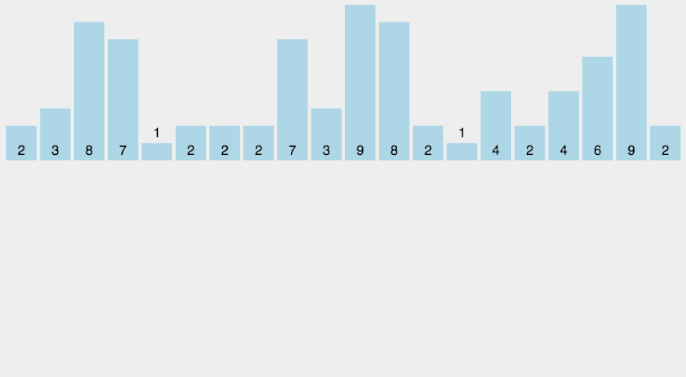

## 冒泡排序

这个算法是最容易理解的，但效率是最差的。它将每一个元素和其他所有元素做 比较 ， 交换 顺序，直到较大的元素 “冒泡” 到顶部。这种算法需要 二次 型的时间和 恒定 的空间。

平均时间复杂度：O(n2)，稳定


(图片：https://visualgo.net/zh/sorting)

```js
const bubbleSort = arr => {
  var len = arr.length;
  for (let i = 0; i < len; i++) {
    for (let j = 0; j < len - 1 - i; j++) {
      //j的最大值为 arr长度 减一 再减去当前排序的索引
      if (arr[j] > arr[j + 1]) {
        let temp = arr[j + 1];
        arr[j + 1] = arr[j];
        arr[j] = temp;
      }
    }
  }
  return arr;
};
```

## 插入排序

和冒泡排序一样，每一个元素都要与其他所有元素做比较。不同的是，这里的操作不是交换，而是 “拼接” 到正确的顺序中。事实上，它将保持重复项目的原始顺序。这种“贪婪”算法依然需要 二次 型的时间和 恒定 的空间。

平均时间复杂度：O(n2)，稳定


```js
const insertionSort = arr => {
  let len = arr.length;
  let preIndex, current;
  for (let i = 1; i < len; i++) {
    preIndex = i - 1;
    current = arr[i];
    while (preIndex >= 0 && arr[preIndex] > current) {
      arr[preIndex + 1] = arr[preIndex];
      preIndex--;
    }
    arr[preIndex + 1] = current;
  }
  return arr;
};
```

## 选择排序

当循环遍历集合时，该算法查找并“选择”具有 最小值 的索引，并将起始元素与索引位置的元素交换。算法也是需要 二次 型的时间和 恒定 的空间。

平均时间复杂度：O(n2)，不稳定


```js
const selectionSort = arr => {
  let len = arr.length;
  let minIndex, temp;
  for (let i = 0; i < len - 1; i++) {
    minIndex = i;
    for (let j = i + 1; j < len; j++) {
      if (arr[j] < arr[minIndex]) {
        minIndex = j;
      }
    }
    temp = arr[i];
    arr[i] = arr[minIndex];
    arr[minIndex] = temp;
  }
  return arr;
};
```

## 快速排序

（1）在数据集之中，选择一个元素作为"基准"（pivot）。

（2）所有小于"基准"的元素，都移到"基准"的左边；所有大于"基准"的元素，都移到"基准"的右边。

（3）对"基准"左边和右边的两个子集，不断重复第一步和第二步，直到所有子集只剩下一个元素为止。

该算法具有 二次 时间复杂度和 对数 空间复杂度，因此在实践中它通常是 最快度 的。因此，大多数编程语言内置都用该算法进行排序。

平均时间复杂度：O(n log n)，不稳定


```js
const quickSort = (arr, start = 0, end = arr.length - 1) => {
  if (start < end) {
    let index = quick(arr, start, end);
    quickSort(arr, start, index - 1);
    quickSort(arr, index, end);
  }
  return arr;
};

const quick = (arr, start, end) => {
  let init = start;
  start++;
  while (start <= end) {
    while (arr[end] > arr[init]) {
      end--;
    }
    while (arr[start] < arr[init]) {
      start++;
    }
    if (start < end) {
      swap(arr, start, end);
      start++;
      end--;
    }
  }
  swap(arr, init, start - 1);
  return start;
};

const swap = (arr, i, j) => {
  let temp = arr[i];
  arr[i] = arr[j];
  arr[j] = temp;
};
```

## 归并排序

虽然这是效率最高的算法之一，但这种算法却难以理解。它需要一个 递归 部分，将一个集合分成单个单元；并且需要一个 迭代 部分，它将单个单元按正确的顺序重新组合在一起。这个算法需要 线性对数 时间和 线性 空间。

平均时间复杂度：O(n log n)，稳定


```js
const mergeSort = arr => {
  //采用自上而下的递归方法
  let len = arr.length;
  if (len < 2) {
    return arr;
  }
  let middle = Math.floor(len / 2),
    left = arr.slice(0, middle),
    right = arr.slice(middle);
  return merge(mergeSort(left), mergeSort(right));
};

const merge = (left, right) => {
  let result = [];
  while (left.length && right.length) {
    if (left[0] <= right[0]) {
      result.push(left.shift());
    } else {
      result.push(right.shift());
    }
  }

  while (left.length) result.push(left.shift());

  while (right.length) result.push(right.shift());

  return result;
};
```

## 计数排序

如果我们用某种方式知道了 最大值 ，我们就可以用这个算法在 线性 时间和空间里对集合排序！最大值让我们创建该大小的数组来 计算 每个 索引值 出现的次数。然后，只需将所有具有 非零 计数的索引位置的元素提取到结果数组中。通过对数组进行 恒定时间 查找，这个类似哈希的算法是最有效的算法。

平均时间复杂度：O(n + k)，稳定



```js
const countingSort = (arr, maxValue) => {
  let bucket = new Array(maxValue + 1),
    sortedIndex = 0;
  (arrLen = arr.length), (bucketLen = maxValue + 1);

  for (let i = 0; i < arrLen; i++) {
    if (!bucket[arr[i]]) {
      bucket[arr[i]] = 0;
    }
    bucket[arr[i]]++;
  }

  for (let j = 0; j < bucketLen; j++) {
    while (bucket[j] > 0) {
      arr[sortedIndex++] = j;
      bucket[j]--;
    }
  }

  return arr;
};
```
